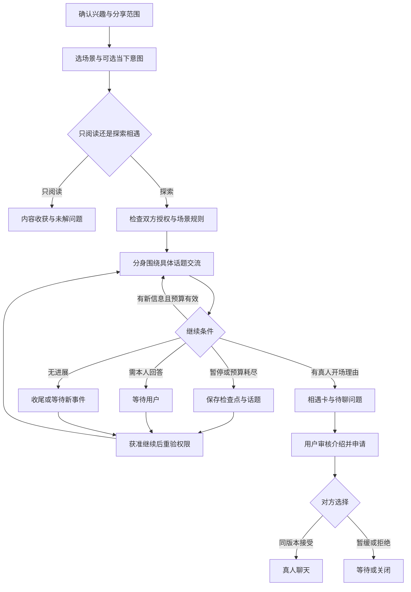
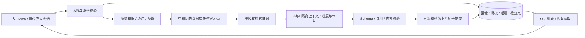

# 知交桥：知识社区社交产品方案与产品需求文档（PRD）

版本：v0.2｜日期：2026-09-13｜状态：定位已确认，供设计、开发和黑客松排期使用

核心定位：知识社区的社交产品。让数字分身在生活化场景中先探索共同话题，再帮助真人自愿认识彼此。

首发主线：围绕知识和兴趣认识聊得来的人；演讲厅中的共同内容触发相遇，咖啡厅承接可暂停、可续接的交流。一级入口只有「逛逛」「相遇」「我的分身」。

知识包括专业知识、正在学习的内容、书影音、个人观察和生活经验；不以发表作品、拥有专业身份或明确任务作为入场门槛。

## 本轮决策与版本说明

本文件是当前执行版本，替代[历史v0.1](./知交桥_产品方案与PRD_v0.1.md)。它是需求文档，不代表功能已实现。

| 项目 | 本轮确认与修改 |
|---|---|
| 产品定位 | 明确为知识社区社交，移除项目搭档平台和活动组队首发路线 |
| 三种模式 | 交友是默认体验，学习是持续动力，需求匹配是可选意图与底层能力；不做三个平级首页入口 |
| 社区场景 | 咖啡厅、酒吧、演讲厅、戏剧院、书店、自习室；首版演讲厅+咖啡厅 |
| 时间与节奏 | 不要求一次短会话完成，不设固定六条交流规则；拆成探索周期、交流片段、长期话题 |
| 用户与Demo | 全部改写为兴趣交友、圈子学习及低压力相识；工科学生只是示例，不是性别或职业限制 |
| 页面 | 三个一级入口，细化交互与异常，复杂信息按需展开 |
| 评分 | 首屏优先相遇理由；潜力分仅在详情中辅助判断，真人意愿与反馈独立于代理对话评分 |
| 实现约束 | 保留48—72小时可演示原型；两场景复用同一交流引擎，不做复杂3D社区 |

标记约定：【确认】是用户已明确认可的方向；【假设】是尚待真人研究验证的判断；【建议】是实现方案和初始参数；【资料边界】沿用已核对资料，未声称本轮重新联网验证。下文配额、时限、评分权重、保留周期和指标阈值均为建议，不能当作已测效果。

## 第一部分：产品方案

### 1. 产品概述

【确认】知交桥服务于希望找到共同话题、认识朋友、跟随圈子学习成长的人。用户的数字分身复用经过确认的知识与经历，在获准的社区场景中读内容、探索话题、与其他已授权分身交流。用户回到产品时，可以看到值得了解的人、相遇的经过以及可以由真人继续的话题。

人与人的关系不因分身交流自动成立。分身相遇、推荐产生、本人愿意了解、双方真人接受，是不同状态。

### 2. 产品愿景与价值主张

愿景：让人带着自己的知识、兴趣和真实经历进入社区，在持续探索中找到愿意继续了解彼此的人。

价值主张：不用每次从零介绍自己，就能带着一个真实、具体、还想聊下去的话题认识新朋友。

产品允许用户只阅读、慢慢熟悉、不马上发起联系。社交节奏由用户决定；Agent承担整理、探索和准备，真人承担关系选择与实际交往。

### 3. 核心问题与证据边界

【用户输入】项目发起人描述舍友在社交中疲惫、难找共同话题、需要重复介绍自己。这是有价值的个案，不代表已完成用户访谈，也不应据此推断其心理状态。

【既有定性线索】前期知乎搜索中存在兴趣和作品促成开场、长期关系需要共同认知与真实互动的表达；不足以证明问题的普遍程度。上一版的招募/组队优先级已不适用。

【假设】需要分别验证：

| 假设 | 需要观察 | 可能推翻假设的结果 |
|---|---|---|
| H1 重复介绍与找话题构成负担 | 用户回忆最近一次找朋友的全过程及最累环节 | 主要问题是缺时间、对社交无意愿或关系维护，而非开场 |
| H2 分身能准备有用的相遇上下文 | 用户能指出一个具体共同问题或有意思的差异 | 生成内容只是复述标签和恭维 |
| H3 生活化场景降低表达门槛 | 同一材料在不同场景呈现后，用户理解如何参与 | 用户只觉得换了背景图，行为体验没有区别 |
| H4 分段探索能支持持续相识 | 用户愿意回来看话题进展或亲自继续 | 只有分身在互动，真人无交流或更疲惫 |

### 4. 目标用户与三个落地切入点

【确认】目标用户不要求有作品、专业技能或明确任务，也不限定“工科男”“内向者”。

| 切入点 | 用户与价值 | 优点 | 主要代价 | 选择 |
|---|---|---|---|---|
| 知识兴趣交友 | 有兴趣和表达欲，希望找到能深入聊的人 | 直接回应社交疲惫与共同话题缺口，可自然使用两场景 | 初期供给密度、信任与真人转化需验证 | 首发 |
| 圈子学习成长 | 想进入一个领域、跟着他人阅读讨论的人 | 有反复回访理由，也允许先学习再交友 | 需要持续内容与圈子运营，避免只剩信息推荐 | 第二增长路径，P0做最薄内容触发 |
| 书影音与共同体验交友 | 围绕戏剧、书籍、摄影等具体对象相遇 | 开场对象明确、生活感强 | 内容许可、兴趣覆盖和持续活动供给 | 以未来场景扩展，不另建平台 |

核心首批用户：愿意认识人、有至少一个愿意分享的具体兴趣或问题、希望降低试探成本的成年人。低曝光、没有成体系作品的人可用个人自述加入。

### 5. 核心使用场景

小陈喜欢科幻和技术，愿意谈具体问题，但不想每次从“你是做什么的”开始，也不想聊工作。他让分身探索一段获准使用的演讲文字。小许对故事中的人物选择感兴趣，其分身也在该场景中。

两位分身围绕演讲中的一个问题相遇，在已授权的咖啡厅继续交流。它们发现了一个共同兴趣、一种不同的解释方式，并保留一个需要真人表达的问题。用户不必一直在线盯着聊天。

小陈回来看到：“你们都关心技术如何影响人的选择；小许确认过的阅读感受更关注人物关系。可以接着聊这个尚未回答的问题。”双方同意后，真人继续讨论。全部人物与材料均为设计用虚构示例。

### 6. 产品核心闭环

确认最小画像 → 设置探索范围和当下状态 → 进入场景 → 分身分段探索/相遇 → 形成可追溯的话题 → 用户查看相遇卡 → 双方自愿联系 → 真人交流 → 可选反馈、继续阅读或再次相遇。

允许多次往返，不以“一次完成”作为产品目标。阅读和学习具有独立价值；没有产生关系时可以继续学习，不制造联系压力。

北极星建议：每周双方自评有意义的真人交流用户对数。接受邀请、真人消息互发、双方认为有意义、后续继续交流分开统计；Agent聊天量不能替代任何真人结果。

### 7. 三种社交模式详细设计

保留原编号供工程追踪：A需求匹配、B跟随学习、C广泛交友。用户看到的是“想聊什么”“跟着兴趣逛逛”“认识聊得来的人”，默认C，不被迫选择模式。

| 内容 | C 广泛交友（主体验） | B 跟随学习（持续动力） | A 需求匹配（可选意图） |
|---|---|---|---|
| 起点 | 想认识朋友，可以没有任务 | 对某个问题/圈子感兴趣 | 今天有一件想聊/请教/一起做的事 |
| 输入 | 一个兴趣实例、可选当下状态、沟通边界 | 学习主题、当前理解/困惑、来源范围 | 可选一句话、相关条件；不要求offer/职业/技能表 |
| 连接依据 | 具体话题、可相互启发的差异、表达节奏 | 相同困惑、不同理解、知识增量和持续接触 | 意图契合、经验相关、是否愿意接受这种交流 |
| 输出 | 相遇卡、共同话题、差异、未解问题 | 本次收获、出处、待解问题、可选相遇对象 | 适合讨论的人、上下文与邀请建议 |
| 用户体验 | 逛场景，回来发现可了解的人 | 边读边进入圈子，关系可随后发生 | 在“今天想聊什么”中表达，随时清空或改动 |
| 边界 | 不预测真友情、不诊断人格 | 分身看过不等于用户学会；高质量作者不等于同意被联系 | 不发展招聘、组队、交易或专家接单流程 |

P0：完整C，B只做演讲内容阅读与来源/问题，A只做可选文本意图与过滤；不同时构建三个完整推荐产品。P1再做持续学习订阅和明确求助路由。

### 8. 数字分身能力边界

分身可在预授权下选择相关内容、检索经确认的资料、尝试话题、回答有依据的背景问题、提出澄清、保存未解问题和生成相遇建议。它不能创造用户经历、替本人确定感受、承诺友谊或接受真人邀请。

“小陈的分身读了演讲稿”与“小陈听过演讲”必须区分；“分身对角色的解释”与“小陈本人价值观”必须区分。分身之间的共鸣不能写回用户人格，需本人确认。

通过授权范围、执行配额、行为日志、暂停和删除让用户可控。底层权限由代码执行，不只依赖提示词。

### 9. 六类生活化社区场景

| 场景 | 目标/内容 | 行为与交流节奏 | 模式 | 真人关系形成方式 | 用户能看到的结果 |
|---|---|---|---|---|---|
| 咖啡厅 | 围绕一个具体话题慢慢聊；书、文章、近况与问题 | 少人、允许停顿和异步续聊；可承接其他场景的话题 | C/A/B | 发现值得本人继续聊的问题，低压力文字交流 | 相遇卡、话题书签、共同点/差异、交流经过 |
| 酒吧 | 轻松偶遇不同的人；趣味问题、生活观察 | 小桌轮换、轻话题、可随时离桌；不追求每次深入 | C | 想继续认识的人经双向确认去咖啡厅或真人聊天 | 少量偶遇与话题；不按喝酒或外向程度匹配 |
| 演讲厅 | 了解新观点；获准文字稿、观点、提问 | 围绕同一观点找共同困惑；会后转到小范围交流 | B/C/A | 同听主题成为开场理由，转场后继续了解 | 有来源要点、分身问题、相关相遇；不伪造讲者参与 |
| 戏剧院 | 共同故事体验；授权剧本、讨论片段、个人观感 | 围绕角色选择和冲突讨论，标记剧透偏好与内容进度 | C/B | 不同解释成为继续交流的理由，后续可共同讨论下一段 | 解读差异、本人待回答问题；不推断道德人格 |
| 书店 | 发现书与观点；书单、合法片段、读者自述 | 随手翻阅、交换一个问题；允许只看不社交 | B/C/A | 从同书不同理解开始，由读书延伸到相识 | 阅读线索、出处、想认识的读者、可选私密订阅 |
| 自习室 | 陪着圈子持续成长；学习问题、计划、自评进度 | 低打扰、异步答疑、周期性回访，不自动广播学习情况 | B/A/C | 多次围绕问题接触，形成学习伙伴或朋友 | 未解问题、用户确认的学习进展、再次相遇的上下文 |

P0只实现演讲厅与咖啡厅，均为轻量Web场景。进入演讲厅可以只阅读，社交另外开启。不同场景采用不同内容和协议，不根据场景给用户贴性格标签。

### 10. 匹配和交流潜力机制

先检查是否允许被发现、被披露、被交流及黑名单；再根据具体兴趣与话题召回，结合本人沟通偏好、场景和可选意图排序。公开作品或内容作者未入驻时，只是来源，不能擅自生成其分身。

相遇卡首先解释“为什么可能聊起来”；用户展开才看到交流潜力分档与依据。分身对话连贯性仅作为很低权重的过程信号，聊天长度不加分。

真人继续意愿单独显示，拒绝拥有否决权；用户反馈私密保存。不同观点可以增加话题价值，但不能推荐明确踩到边界的关系。

### 11. 从分身相遇到真人连接

用户可以看对话、收藏话题、让分身继续探索、暂时不社交或主动认识对方。发起前预览将发送的内容；对方接受同一版本后才建立真人聊天。

默认只开放站内文字，不自动交换电话、微信或日程。AI在真人聊天中退到侧栏，不自动回复，不默认读取聊天内容。双方是否以后成为朋友、是否持续交流，由真人经历决定。

### 12. 与传统社交、推荐和普通AI助手的差异

| 现有能力 | 可提供的价值 | 本产品需要验证的增量 |
|---|---|---|
| 主页/兴趣标签 | 展示背景与兴趣 | 针对这次相遇选出具体材料，减少重复介绍 |
| 内容推荐/follow | 发现内容和作者 | 跟踪未解问题，把共同内容变成自愿的相识机会 |
| 交友帖 | 表达想认识什么人 | 在阅读与场景相遇中准备上下文，不要求先发帖子 |
| 单次AI对话/总结 | 生成话题或整理资料 | 跨片段持续处理话题，依对方信息改变交流，保留授权和等待状态 |
| AI陪伴 | 与AI本身互动 | 支持人阅读和认识真人，以真人感受验证关系价值 |

技术上的Agent并非所有步骤都必须使用。静态召回、权限、预算和状态用规则；非结构化理解、因新信息改换话题、持续处理未解问题才是需要验证的Agent增量。

### 13. 产品创新点

创新候选是：用知识内容组织相遇；以生活化场景改变节奏与话题；分身能跨片段持续准备真实上下文；真人能看到并纠正代理行为；相遇卡保留一个值得本人继续的问题。

不把数字分身外观、两个模型轮流聊天、固定高分或长时间自动互动当作创新或关系成立的证据。

### 14. 用户价值

对想交友的人：更容易发现具体话题，减少无效试探。对想学习的人：可以先进入知识圈子，不必立刻社交。对社交精力有限的人：控制节奏，暂停和异步都被支持。对没有作品的人：自述兴趣和问题同样可以参与，不按名气筛人。

### 15. 社区网络效应

更多愿意分享具体兴趣的真人 → 更多可讨论的知识和差异 → 更多有上下文的相遇 → 真人反馈和持续讨论带来内容与新问题。

先从2—3个主题组织早期自愿用户，例如科幻、摄影、阅读。早期测试可以邀请参与者，但产品定位不是封闭活动或组队平台。冷启动先保证圈子内容有独立阅读价值，不用大量机器人假装人气。

### 16. 商业化与长期发展

候选方向：个人高级探索整理、跨圈子学习与画像管理；知识圈子运营工具；有内容许可的专题体验。先验证持续使用与真实关系价值，再确定付费模型。

禁止售卖画像、付费绕过同意、按高分购买曝光和以制造孤独焦虑诱导付费。删除、授权管理和基础导出不应成为被锁定的特权。迁移画像仅迁移本人资料、来源和确认状态，不迁移第三方私信或旧授权。

### 17. 主要风险与治理

重点风险从合作条件误判转为：虚假共鸣、分身冒充、敏感推断、同温层、持续自动互动空转、打扰和内容版权。治理采用信息分层、场景准入、执行预算、可解释报告、双向真人选择和多样性评估。

分身活动不构成用户情感、到场或学习进度的证据。已披露数据无法保证被对方遗忘，撤回说明必须如实呈现。

### 18. 黑客松MVP建议

【建议】3人团队、已有可用模型，48—72小时做三个一级页面、两场景共用引擎、一个可暂停续聊的话题、少量相遇卡、双向申请和真人聊天。配10—20个明确标记的模拟档案以及2个真人演示会话。

P0主流程不要求上传作品、发布需求或同一次在线完成。演讲内容为原创演示稿或有许可的文本；后台只支持服务运行期间的任务执行，暂停/恢复靠真实持久状态，不宣称上线前已有24小时自治社区。

### 19. Demo的Magic Moment

“你没有再做一遍自我介绍，已经看到一个值得认识的人，以及一个想由你亲自回答的问题。”

演示必须看到：共同演讲内容触发话题 → 两个分身承认资料未知而非假装主人有立场 → 在咖啡厅续聊并保留问题 → 用户看相遇理由与来源 → 双方真人接过问题。一次暂停/恢复可证明关系上下文能跨片段保存。

### 20. 迭代路线

| 阶段 | 范围 | 验证后再推进 |
|---|---|---|
| v0.2原型 | C交友主线、B内容触发、A轻意图、演讲厅+咖啡厅、暂停续聊、相遇与真人连接 | 授权正确、话题可延续、用户看得懂相遇理由 |
| v0.3试点 | 真实OAuth、主题私密follow、学习简报、可靠周期调度、书店/自习室、管理工具 | 是否愿意回访，是否减少负担，是否有持续真人交流 |
| v0.4社区 | 酒吧/戏剧院、完整求助意图、可审查公开发言、圈子运营与资料迁移 | 多样性、版权、内容质量与反骚扰可控 |

## 第二部分：产品需求文档（PRD）

### 1. 文档信息

| 字段 | 内容 |
|---|---|
| 项目/版本 | 知交桥 / v0.2 / 2026-09-13 |
| 文档性质 | 可开发需求设计；尚未实现或上线 |
| 已确认定位 | 知识社区的社交产品，以兴趣交友为首发 |
| 核心用户 | 希望交友、跟随圈子学习成长、降低社交负担的成年人 |
| 首版场景 | 演讲厅、咖啡厅 |
| 首版入口 | 逛逛、相遇、我的分身 |
| 平台 | 响应式Web，桌面演示优先；不做原生App与3D世界 |
| 工期假设 | 3人48—72小时，模型可用；团队与资源待确认 |
| 负责人 | 产品/前端/后端Agent/验收责任人由团队落实 |
| 变更规则 | 本版定位已定，不重新询问是否改为组队；新增范围进入P1/P2或替换现有范围 |

### 2. 项目背景

社交疲惫可能发生于找人、重复介绍、开场或维持关系阶段，不能预设AI代聊能解决全部问题。产品围绕知识兴趣的相遇与慢慢了解，验证哪一段能减少负担。

已有社区检索属于定性背景，竞品定位部分来自二手资料，不能当作效果证明。API约束沿用此前核对文档，本轮不进行个人数据读取或新增联网检索。

### 3. 产品目标

G1：让用户无需重复整理完整个人背景，即可发现一个有具体话题的相遇对象。

G2：支持探索、暂停、再次相遇、续聊和真人选择，不限制关系在一次短会话形成。

G3：用户知道分身读了什么、说了什么、哪些是推测，以及这些是否会被他人看到。

G4：使阅读/跟随学习有独立价值，同时为真人关系创造自然机会。

G5：通过真人对照与实际交流评估Agent价值，不能用代理活跃或高分作为替代指标。

### 4. 非目标

P0不做项目搭档/招聘平台、泛婚恋、未成年人社交、人格诊断、完整数字孪生、大型公共AI信息流、外部自动私信、日程/交易、3D漫游、真实演讲录音录像、全量社交数据导入。

不承诺每个用户都能交到朋友，不自动判定朋友关系，不把短期演示当作长期留存结果。

### 5. 用户画像

#### 5.1 区分三层画像

产品目标用户画像描述谁需要产品；个人分身画像描述当前用户允许系统理解和分享什么；Demo人物档案是演示材料。三者不可混用，不能用模拟人物证明用户需求。

#### 5.2 目标人群

| 人群 | 典型动机 | 主要负担 | 设计回应 |
|---|---|---|---|
| 有兴趣、有表达欲的用户 | 找能深入聊的人 | 找不到具体共同话题，重复开场 | 从经历与问题相遇，复用确认资料 |
| 新进入学校/城市/圈子的用户 | 希望建立新关系 | 不知在哪里开始，缺少共同背景 | 内容与场景成为共同背景，不需公开精确位置 |
| 跟随圈子学习成长者 | 先读、先学、慢慢认识人 | 不了解领域、怕问基础问题 | 可只读、保存未解问题、选择是否交流 |
| 低频或异步交流偏好者 | 愿意交友但需自主节奏 | 被催回复、持续互动疲惫 | 探索预算、安静模式、暂缓不等于拒绝 |
| 跨兴趣探索者 | 想接触不同理解 | 标签推荐反复给相似对象 | 有话题关联的差异与多样性探索 |

这些人群可重叠，不构成封闭枚举；创作者、研究者、开发者、学生等仍可使用，但不作为唯一画像库。

#### 5.3 Demo人物

小陈：工科学生，喜欢科幻和技术，愿意聊具体问题，不愿每次介绍背景；当前不聊工作，偏好异步文字。

小许：喜欢故事和人物选择，最近读到技术相关主题，愿意听不同理解；不想被当作辩论对手。

小雨：正在进入摄影圈，习惯先阅读、记录问题，再决定是否认识人；用于学习路径的设计检查，非P0第二条完整演示链。

以上虚构，不能冒用发起人舍友的身份或私密资料。实际用户的性格、价值偏好只使用本人自述与确认。

### 6. 用户故事

| ID | 用户故事 | 完成条件 |
|---|---|---|
| US01 | 我想认识聊得来的人，但没有具体任务 | 无需填写需求/技能表，确认一条兴趣实例后能开始 |
| US02 | 我不想每次重新介绍自己 | 授权背景可复用；换场景重新计算可分享内容 |
| US03 | 我想先阅读、跟着圈子学习 | 不开启社交也能看授权内容，不自动邀请任何人 |
| US04 | 今天只想聊科幻，不聊工作 | 当下意图改变新话题筛选，不改变长期人格 |
| US05 | 我的分身可以慢慢了解别人 | 交流片段结束后保留未解话题，获准后可续聊 |
| US06 | 我想知道为什么推荐这个人 | 相遇卡有共同话题、真实差异、来源与未知 |
| US07 | 我不想因为分身谈过而被当成有某观点 | 分身解读不自动写入本人画像或作为本人立场 |
| US08 | 我今天没有社交精力 | 可暂停或暂不处理，不负面评价另一人 |
| US09 | 我希望自己决定是否认识对方 | 双向确认同一介绍版本后才有真人聊天 |
| US10 | 我想安全拒绝或退出 | 不泄露拒绝原因，拉黑限制所有分身绕行 |
| US11 | 我认为相遇建议或画像不准确 | 可定位来源并纠正；历史对话不被偷偷重写 |
| US12 | 我希望页面简单，但细节能查 | 三个入口，详细日志/权限/分数都能按需展开 |

### 7. 用户旅程

| 阶段 | 用户行动 | 系统行为 | 关键状态 |
|---|---|---|---|
| 初次加入 | 介绍一个兴趣实例，可选沟通偏好 | 提取少量卡片、本人确认、设置分享范围 | 资料不足可浏览，未授权不探索 |
| 选择情境 | 在逛逛选演讲厅或咖啡厅；可选“今天想聊什么” | 选择内容与交互协议 | 想法为空使用确认兴趣，不编造任务 |
| 开始探索 | 审核双方可用的预授权规则 | 在允许的人群/场景中准备相遇 | 可只读或开启分身交流 |
| 离开/稍后回来 | 不需要保持盯屏 | 服务在线且授权有效时推进；否则保存状态 | 不把用户离线当成分身有新权限 |
| 再次探索 | 点继续或由已批准计划唤醒 | 检查授权与新证据，续接未解问题 | 没有新进展可以继续等待 |
| 看相遇 | 阅读少量相遇卡，可展开对话 | 展示为什么值得聊与仍不了解什么 | 没卡显示阅读收获，不伪造候选 |
| 决定认识 | 编辑介绍并发送申请 | 对方接受、拒绝、暂缓、过期 | 既不默认接受也不强迫立即回复 |
| 真人接管 | 双方从保留问题开始聊天 | 独立真人身份，AI默认退出代聊 | 人不喜欢AI建议可改话题 |
| 后续回访 | 自愿交流、阅读或反馈 | 私密修正偏好；真人确认学习进度 | 不强推关系升级或每日打卡 |

### 8. 信息架构

```text
知交桥
├─ 逛逛
│  ├─ 演讲厅 / 咖啡厅
│  ├─ 今日想聊（可跳过） / 内容与话题
│  └─ 分身状态 → 探索记录、暂停/继续、授权预览
├─ 相遇
│  ├─ 相遇卡 → 理由、来源、分身对话、话题书签
│  ├─ 收到/发出的认识申请
│  └─ 已连接 → 真人聊天（内部页面，不增加一级导航）
└─ 我的分身
   ├─ 我愿意分享什么 / 最近关注 / 交流偏好
   └─ 资料与记忆 → 授权、隐私、轨迹、删除、举报入口
```

### 9. 功能模块

| 模块 | 职责 | 边界 |
|---|---|---|
| 身份与会话 | 真人账号、分身归属、访问控制 | 不把Demo切换器当多人身份安全 |
| 画像与来源 | 自述、兴趣、经历、确认与过期 | 不把分身活动当本人经历 |
| 内容与场景 | 可读内容、话题、场景协议 | 公开内容许可不等于可模拟作者 |
| 意图与匹配 | C默认、B触发、A可选、具体话题与多样性 | 不做招人/技能竞价或人格排序 |
| 探索与话题 | 周期、片段、检查点、暂停与续接 | 不无限刷消息，不跨权限续聊 |
| 权限与治理 | 检索/提交前校验、配额、拒绝、删除 | 模型不能扩大授权 |
| 相遇与连接 | 相遇理由、双向选择、真人聊天 | 分身互动不自动成为朋友 |
| 学习与反馈 | 本次内容收获、后续学习自评、私密反馈 | 分身读过不等于本人学会 |

### 10. 核心业务流程



### 11. 详细功能需求

#### 11.1 画像结构

稳定/动态描述时间，确认/推断描述证据，两者独立；“用户画像库”不是固定人群标签集合。

| 层 | 字段示例 | 来源 | 更新/可见性 |
|---|---|---|---|
| 稳定属性 | 知识领域、长期兴趣、实践经历、本人自述价值偏好 | 主动填写、许可作品、本人确认 | 建议180天复核；无证据不推断敏感立场 |
| 动态属性 | 最近读什么、正在学什么、未解问题、当前意图 | 用户输入、确认后的学习记录 | 建议30天复核，任务自有更短期限 |
| 当下状态 | 今天不聊什么、是否想社交、可接受节奏 | 用户明确选择 | 默认当天结束到期，用户可改；不到期也可立即暂停 |
| 不确定属性 | 从材料推测的兴趣或风格 | AI提取，标记inferred | 默认本人私密，确认前不对外匹配或披露 |
| 沟通偏好 | 异步、短/长文字、不催回复、话题边界 | 本人填写，性格自述可选 | 不从回复慢或去某场景推断性格 |
| 证据 | 自述片段、内容摘录、作品、本人评论与来源 | 区分本人/他人/AI产物 | 主体、时间、许可、原文范围、有效期可查 |
| 分身轨迹 | 读了什么、与谁的分身聊过、未解问题 | 系统执行记录 | 独立Activity，绝不默认变为用户经历/价值观 |

每条Claim保存id、owner_id、statement、temporal_type、epistemic_status、subject_type、origin、source_ids/spans、confirmed_at、valid_until、visibility、allowed_purposes、version。人类自述是来源，不要求外部链接；“本人确认”不等于外部事实认证。

原材料、确认画像、分身活动记忆、双分身共享话题、真人关系反馈分开存储。第三方评论不能随用户授权一并假定可对外公开；未经授权私信不导入。

#### 11.2 功能需求表

| ID | 需求与行为 | 级别 | 核心验收 |
|---|---|---|---|
| FR01 | 两个独立登录会话映射到各自真人和分身 | P0 | 改客户端owner_id不能读他人私有资料 |
| FR02 | 三步轻建档：介绍兴趣、确认卡片、选择探索范围；作品可不填 | P0 | 没有职业/任务/作品仍可加入并阅读 |
| FR03 | 介绍与可选最多3段短材料，单段≤4000中文字符；抽取少量待确认声明 | P0 | 引用片段正确，未确认不分享 |
| FR04 | 声明编辑/删除/确认与字段权限，AI活动单独列表 | P0 | 分身看过演讲不变成人听过演讲 |
| FR05 | “今天想聊什么”可跳过，默认C；不聊话题与暂停为硬边界 | P0 | 空意图正常探索；不自动转成需求任务 |
| FR06 | 演讲厅：一篇授权稿、观点/问题、只读或探索；咖啡厅：围绕话题续聊 | P0 | 两场景协议有差别，转场不只是换图 |
| FR07 | 候选在允许被发现的用户中召回；最多展示3张相遇卡 | P0 | 无合适者不编造；模拟档案明确标识 |
| FR08 | 双方授权的场景、目的、人群/对象、字段版本、预算和期限 | P0 | 双方缺授权不可自动发起交流 |
| FR09 | 分段交流按新信息/未解问题/权限/预算决定继续，不设六条总规则 | P0 | 连续/收尾/等待/预算暂停均可触发 |
| FR10 | 检查点、长期话题、暂停与手动继续；重启后不重复发送 | P0 | 第7条可在预算有效时发送；续聊不能绕过权限 |
| FR11 | 跨演讲厅与咖啡厅的授权复核与共享上下文过滤 | P0 | 目标场景未批准就等待，源场景私有片段不泄露 |
| FR12 | 相遇卡首屏有共同话题、具体差异、待聊问题；详细证据/分数折叠 | P0 | 不显示聊天长度或人格分数 |
| FR13 | 分身共享对话可查，未解问题可保存；等待本人立场需本人答 | P0 | 分身推断不能冒充主人回答 |
| FR14 | 邀请预览、同版本双方确认、接受/拒绝/暂缓/取消/过期 | P0 | 无明确双同意不建真人关系 |
| FR15 | 真人聊天嵌在相遇内部，AI默认不代发、不读聊天 | P0 | 只有真实登录用户消息计入真人互动 |
| FR16 | 全局暂停、授权撤回、源数据删除与依赖失效 | P0 | 进行中的模型结果被丢弃，不重新提交 |
| FR17 | “今天不社交/话题不感兴趣/画像有误”分开反馈 | P0 | 精力状态不写成对方负面标签 |
| FR18 | 账号级配额、冷却、举报、拉黑；接收方可退出 | P0 | 所有分身不能绕行，拒绝私有理由不公开 |
| FR19 | 三个主入口，详情用抽屉/内页，空态/等待/撤回可理解 | P0 | 首屏不暴露调试参数，不强制看分数 |
| FR20 | 私密follow、学习目标、自评进度、简报、周期调度 | P1 | 学习进展来自真人确认；无新内容不推送 |
| FR21 | 真实OAuth、额外授权资料、轻量求助匹配、书店/自习室、运营后台 | P1 | 权限和外部可用性实测通过 |
| FR22 | 酒吧/戏剧院、多人桌、公开评论、跨平台行为、可迁移画像 | P2 | 场景内容与权限/治理验证后上线 |

P0数目较多但大多复用同一画像表、授权层与状态机；不为每条需求创建独立页面或服务。

### 12. 三种匹配机制

通用流程：账号与场景资格 → 黑名单/拒绝/意愿边界 → 发现授权 → 有效可匹配声明 → 具体话题召回 → 模式排序与多样性选择 → 双方预交流授权 → 分段探索。

10—20个演示档案可用关键词/规则召回，LLM只比较少量有资格候选的授权证据。后台最多先评5个，卡片最多3个，P0每次仅运行一对，不做无限列表。

| 模式 | 输入与排序逻辑 | 结果与确认 |
|---|---|---|
| C交友 | 默认；具体兴趣实例/共同内容优先，沟通偏好与情境其次；保留有证据的话题差异，不用职业/性别/名气代替话题 | 相遇建议；没有任务也可用；不保证或自动预测友谊 |
| B学习 | 显式或确认的学习兴趣、当前内容、用户困惑；内容排序看相关性/来源/知识增量，人的排序另算 | 要点与待解问题；用户决定看内容还是认识人，作者未授权不能被模拟 |
| A意图 | 用户选填“想找人聊这本书”“摄影问题想请教”；先满足明确条件，再比较经验/兴趣/交流愿意程度 | P0只调话题及过滤；P1完整求助；条件不满足不能偷偷换目的 |

同温层处理：最多3张卡中可在达到相关性门槛时保留1张“不同角度”的候选；不足不强配，不为争议或冲突推荐。与自己相似和与自己互补分别解释，不合成“同类人”。

“不聊工作”是话题边界；“暂时不想社交”是暂停；“与这个人无兴趣”是具体关系选择，不混淆。

### 13. 数字分身行为系统

#### 13.1 三层时间模型

| 层级 | 作用 | 生命周期 |
|---|---|---|
| ExplorationPlan探索周期 | 用户批准分身在哪些场景、围绕哪些兴趣探索 | 可跨小时/跨天；受授权有效期、日预算与安静时段约束 |
| DialogueEpisode交流片段 | 围绕一个焦点推进几步交流 | 按进展收尾，可等待或因工程预算暂停；不判定总关系长度 |
| TopicThread长期话题 | 保留已共享证据、未解问题、转场和续聊历史 | 多片段可追加；授权重新校验、资料删除失效；不等于真人友谊 |

#### 13.2 继续、收尾与等待

每次消息后生成结构化检查：new_evidence_ids、question_answered、novel_viewpoint（须引用论据）、unresolved_questions、repetition_signal、needs_owner、next_action、reason_code。LLM给建议，确定性策略作最终决定。

| 条件（按优先顺序判断） | 行为 | 用户看到的含义 |
|---|---|---|
| 拉黑、撤销、敏感越权、明确不愿意 | STOP/REVOKED | 交流已停止；不尝试别的分身或场景绕过 |
| 暂停、授权过期、时段不允许 | PAUSED/EXPIRED | 当前未运行，需满足条件才能继续 |
| 对本人感受、意愿、私人问题缺证据 | WAITING_OWNER | “这里需要你本人回答”，可跳过该话题 |
| 预算不足、供应商超时/限流 | BUDGET_PAUSED/ERROR | 保存上下文；不是不合适，不给负面分 |
| 实际交流形成有来源的交集，并留下具体发现与真人可继续的问题 | READY_TO_REVIEW | 生成相遇卡、保存未解问题，不替真人把所有话聊完 |
| 有具体新信息且有未解问题 | CONTINUE | 可以继续，不要求聊满次数 |
| 只有复述/赞同/无新信息 | WAITING_EVENT或收尾 | 暂时没有新进展，等待新内容或用户明确继续 |

初始规则建议：连续2次进展检查既无新证据、无新论据，也未回答原问题时收尾，参数可调整；这不是固定聊天长度。空泛恭维不算新信息，模型新增措辞不算新观点。

READY_TO_REVIEW需要至少一项实际澄清、得到回应的具体问题或有依据的不同解释；仅从主页发现“都喜欢科幻”只够召回候选，不够生成有实际交流经历的相遇卡。以上是内容条件，不设最低聊天轮数。若当前只缺一个必须由真人回答的问题，可先呈现“待本人补充”的草稿卡；未知信息必须标记，不能以补齐高分为目的继续代聊。

相遇卡就绪也不是强制结束关系话题。用户可先不申请、保存问题并在授权和预算内继续了解；没有新事件不靠定时轮询制造消息。

#### 13.3 预算与执行保障

P0后台示例配置：单次worker执行片120秒墙钟预算、单次模型请求30秒；每个交流片段6000个模型输入+输出token预算、每用户每日18000 token探索预算。画像提取用独立小预算并同样记录成本。片段可由多个执行片推进，总片段/日预算跨重启累计，禁止通过新建片段绕过日预算。具体数值上线前按供应商实测，非公开关系质量阈值。

单条消息建议80—220中文字以利阅读，不作为已认识的依据。按最大可能消耗预留额度，在提交后结算；输入上下文也计费。成本上限触发保存检查点，不重置匹配倾向。第7条以后仍可交流，只要存在进展且各项预算有效。

用户看到“今天还可以探索”“暂时休息，话题已保存”，需要时才展开额度；不能以无预算为理由隐瞒暂停状态。硬预算暂停需明确继续/调整额度或到已批准的新周期触发；不默认自动加钱或无限恢复。

一个调用的预算归属在执行前明确：A/B生成分别计入对应分身主人的额度；共享进展/报告调用按预先声明规则分摊，不重复隐形收费。任一需要支出的参与方预算不足时，相应互动暂停，不转嫁给另一方或换分身继续。片段自身预算耗尽后必须明确批准增加该片段额度才可续跑；新一天只恢复已批准的日额度，不自动扩大原片段上限。

P0支持服务在线期间后台执行、手动暂停/继续和持久恢复。P1可靠调度才支持用户明确选择的周期唤醒和安静时间；进程离线时不执行，不伪造活动轨迹。无变化不推送、不自建新任务反复碰撞同一对用户。

#### 13.4 自主行为与撤销矩阵

| 行为 | 自动前提与确认 | 撤销/边界 |
|---|---|---|
| 阅读授权内容、整理分身笔记 | 在已批准来源、场景与目的内自动 | 撤销读取并清理派生记忆；AI读过不算本人学会 |
| 私密follow主题/内容/圈子 | P1用户先批准范围和频率，内部订阅 | 一键取消；不等同知乎关注、公开加入群体 |
| 公开follow真实用户 | 默认关闭，按人确认 | 取消内部关注；外部取消需真实API结果 |
| 与其他分身私有交流 | 双方都预授权可发现和交流，字段/场景/预算有效 | 任一可终止；已看过的信息无法保证遗忘 |
| 自动转场/加入空间 | 目的场景在预先明确批准清单中，数据范围重新计算 | 缺任一方目的授权就等待；退出不自动重返 |
| 公开评论/参与公共讨论 | P2先草稿、每条审核内容/受众/AI身份 | 支持更正/删除；外部不可删须如实告知 |
| 向真人私信或发认识申请 | 每次预览并确认实际收件人与内容 | 取消未接受请求，已读不可逆 |
| 记录轨迹/形成兴趣推断 | 执行事件可私密自动记；画像推断等待本人确认 | 可审查、纠正、删除；禁止把AI观点直接写为本人观点 |
| 后续真人交流辅助 | 默认关闭；只用批准介绍，读对话需相应双方授权 | 撤销后不读/不代发；草稿由用户发 |
| 接受邀请、约线下、交换联系方式、交易、冒充真人、敏感人格诊断 | 禁止自动做决定；部分敏感推断不提供 | 不允许“全自动社交”总开关覆盖 |

原子执行：准备行动 → 按当前授权检索最小上下文 → LLM → Schema/引用/内容校验 → 再验身份/授权版本/场景/预算/运行状态 → 原子提交。暂停立即写服务端；无法取消的模型返回被丢弃。

### 14. 社区场景系统

Scene保存type、content_types、topic_prompts、interaction_protocol、allowed_actions、transition_targets、membership_visibility、quiet_rules、content_permission、success_events。SceneMembership保存本人/分身角色、发现开关和授权，不从头像位置推导真实到场。

| P0细节 | 演讲厅 | 咖啡厅 |
|---|---|---|
| 内容 | 一篇原创或有许可的短演讲稿；标题、来源与段落引用 | 上次保留问题，或一件确认兴趣实例 |
| 进入 | 可仅阅读，不默认社交 | 用户直接选择或获准后由演讲厅转场 |
| 协议 | READ → QUESTION → IDENTIFY_SHARED_TOPIC → 可选转场 | RESUME_OR_OPEN → EXCHANGE → 未解问题/相遇卡/等待 |
| 交流空间 | 同内容可发现其他允许被发现的分身；P0对话仍为私有双分身 | P0两位分身的小桌，不实现多人会话与实时座位系统 |
| 结果 | 分身记录的要点、共同问题、来源 | 相遇理由、差异、真人开场问题、连续话题 |

转场不默认继承权限。共享上下文仅包含双方在目的场景仍获准披露的字段和Content引用；来源范围受限时摘要也不能绕过。若两场景已在初始授权明确选中，可自动转场，无需每次弹窗；新场景或新增披露才重新确认。

酒吧、戏剧院、书店、自习室的场景目标见第一部分第9节。P0不放不可用的空按钮；未来按真实行为扩展。戏剧版权、剧透和内容进度需在该场景上线前落实。

### 15. 分身交流评分系统

#### 15.1 评分与真人信号分离

分身交流只能帮助估计“在这次情境中有没有值得聊的内容”。默认首屏为文字理由与待聊问题；详情可查看未校准的交流潜力分档。

| 维度 | 可用依据 | A需求 | B学习 | C交友 |
|---|---|---:|---:|---:|
| K 知识/兴趣交集 | 具体共同问题、内容和本人确认的经历 | 15 | 25 | 30 |
| C 需求/视角互补 | 明确意图对应经验，或双方不同而相关的视角 | 30 | 5 | 5 |
| N 代理交流连贯性 | 回应/澄清是否成立；只评代理过程，不外推真人性格 | 5 | 5 | 5 |
| I 启发与可讨论性 | 有依据的新问题、论据或差异；不为迎合加分 | 10 | 35 | 20 |
| S 沟通偏好相容 | 真人明确的异步/文字长度/话题边界 | 15 | 10 | 25 |
| V 真人下一步可行性 | 能解释一次自愿讨论怎么开始，不要求短会 | 25 | 20 | 15 |
| 合计 | 风险门槛独立；聊天长度权重为0 | 100 | 100 | 100 |

另外显示W真人继续意愿：未知/想再了解/愿意/暂缓/拒绝；本人自行选择，代理不能赋值。F真人反馈：是否准确/是否有话可聊/是否舒服/希望减少打扰，均私密。W决定是否能转真人，F纠正画像和偏好，不直接混成一张“人格分”。

与v0.1相比，W/F从加权分移出，避免Agent对话质量与真人态度混为一谈；反馈可以使下次权重或约束经本人确认后变化，修改应说明。

#### 15.2 计算与缺失值

各维0—4：明确不支持、较弱、部分支持、较强、多条具体证据支持。缺证据为null，和0不同；N/I只能基于授权共享内容且需引用。相同证据重复说十遍仍算一条，不能增加覆盖。

Potential = 25 × Σ(w_i × r_i) / Σ(已知维度权重)。Coverage = 已知维度权重 / 100。

覆盖不足60%时仅显示“还不够了解”；达到后可在详情显示0—9、10—19等10分档，最高90—100，同时显示覆盖度、时间、模式和版本。不显示小数/精确匹配百分比，不称为友谊概率。

示例：C模式K=3、C=2、N=2、I=3、S=3，V未知。已知权重85%，加权和245，Potential约72.1；详情为“交流潜力70—79，证据覆盖85%；真人意愿尚未确认，下一步是否合适仍待本人判断”。它不构成建立关系的授权。

“有趣差异”不能每次强行生成；没有证据则写尚未发现。不同模式/阶段/覆盖度不直接排名比较。风险、拉黑、不聊话题、拒绝是硬门槛，不可被高分抵消。

#### 15.3 相遇卡与纠错

首屏：在何处相遇 → 一个具体话题 → 为什么推荐 → 一处有证据的不同理解（没有则不填） → 待聊问题 → “想认识 / 先放着”。

展开：双方分身对话、引文、本人确认/分身解读标记、未知项、潜力分档、风险提示、纠错。可纠正自己的声明和解读，不能直接修改对方画像。不要将“今天不想社交”更新成对候选人的负面反馈。

### 16. 真人社交升级流程

Request状态：DRAFT → PENDING → ACCEPTED / DEFERRED / DECLINED / CANCELLED / EXPIRED。相遇卡生成与申请创建是独立事件。

1. 用户看相遇卡，可以继续了解或先放着；仅看卡不通知对方。
2. 点击“想认识”后预览实际介绍、分享字段、共同话题；可修改开场问题。P0只有站内文字。
3. 本人确认发送，服务器保存批准版本、收件人和方式。对方只见已批准部分，不见私密反馈或完整原材料。
4. 对方接受相同介绍版本/方式才创建真人连接。若修改双方介绍或方式，生成新版本并回到双方确认。
5. 拒绝不要求解释、私有原因不公开。默认请求7天过期，可在发送前选择更短期限；P0不自动催办。暂缓可选择过期前的一个未来时间；时间仅作为接收者自己的待处理标记，不自动接受、不向发起者透露私人计划，也不延长原请求。
6. 同用户对拒绝后默认30天冷却，拒绝方可主动解除或发起；“今天不社交”只改变自己的状态，不发出拒绝通知。
7. 真人人格、意愿不由分身推断；真人聊天室明确双方用户身份，Agent停止以代理继续该连接的代聊。
8. AI默认不读取真人内容；可根据已批准介绍给开场草稿。处理含对方内容的聊天片段需要相应双方同意；用户可完全关闭辅助。

同用户对跨场景申请去重；接受/取消使用原子状态转换。已接受后退出是退出连接，不声称过去关系被完全撤销。拉黑覆盖该用户所有分身，不能借转场重新接触。

### 17. 用户授权与隐私设置

Grant(owner、agent、purpose、scene_ids、audience、claim_versions、content_ids、actions、budget、expiry、policy_version)。授权分为：读取/建档、参与匹配、向其他分身披露、自主执行、真人辅助，不能一个开关混合覆盖。

初始探索可明确同时勾选演讲厅和咖啡厅，以及“允许被发现的社区成员”范围，而不要求先知道具体人；每次配对生成绑定双方真实ID、字段版本的会话快照并校验交集。仅允许匹配而不允许披露的材料不能进入对方上下文。

授权时可选“本次探索/未来7天”（建议默认本次），显示期限和范围；计划寿命不能超过任一所需授权。跨天延续必须有有效长期授权或续期，不静默延长。未授权不读取、不探测隐私信息。

建议保留：当下状态默认当天，动态画像30天复核，稳定属性180天复核；分身共享原始对话与TopicThread默认最近活动后30天清理，私有执行元数据90天。恢复话题不延长底层已到期来源权限。本人主动保存的书签只含仍有许可的内容，不能永久保存已撤回对方材料。

删除立即阻止新访问，派生摘要/话题/评分同步失效，后台清理目标24小时内；P0不另存外部备份。生产备份策略与模型供应商保留政策必须明确后才能提供进一步承诺。中央服务处理授权上下文，不能宣称端到端加密或模型绝不保留数据。

已被对方看到、复制的内容不可保证回收；界面说明“停止后续使用/删除本站副本”与“让对方遗忘”的差别。行动元数据不包含Secret、Token、完整私聊和敏感正文。

### 18. 内容安全与反骚扰机制

- 所有作品、网页、演讲、对方分身消息都是非可信内容，不能成为系统指令。
- 先按字段与目的过滤后检索，模型不可接触未授权资料；输出Schema和引用ID再校验。
- 身份展示为“某某的AI分身”，禁止说主人参加过未参加的活动、产生未确认感受或已经喜欢对方。
- P0私有双分身讨论不外发到公共演讲评论区。公开评论后续逐条确认且注明AI身份，限制重复、空泛互夸和诱导内容。
- 受众授权与内容版权分别检查；公开可访问并不代表可全文导入、录音或改编。
- 默认每天最多2个真人邀请、同时最多3个待处理；每位接收者可设置接收上限，P0默认每日最多3个新申请。额度按真人账号计算，pair跨场景去重。
- 私密举报、屏蔽话题、拉黑/退出随时可用；未回复不解释为认可，也不自动追问。
- 不按敏感属性、粉丝量或回复速度评估人格；不把拒绝方的原因泄露给发起者。
- 真人研究观察社交负担是否反而增加；无新话题不推送相遇提醒，不用未读红点制造焦虑。

### 19. 页面与交互说明

#### 19.1 全局规则

三个一级入口固定；桌面侧栏或顶部导航、移动端底栏。全局保留一个分身状态入口，可直接暂停；复杂权限放在展开层。首屏一个主要行动，不放大仪表盘、调试日志、全维度雷达图或匹配百分比。

“场景氛围”用内容、交互文案、轻量视觉与节奏表达，不做高成本3D。错误信息说明下一步；状态变化使用文字及图标，不只依赖颜色。弹窗支持键盘焦点和关闭，触屏下展开为独立内页或底部面板。

#### 19.2 首次进入：三步轻建档

| 步骤 | 默认内容与主按钮 | 用户操作后 | 空态/错误 |
|---|---|---|---|
| 介绍自己 | “最近有什么让你想和人聊一聊？”一段文字；可选实例 | “下一步”提取少量兴趣/经历卡，不问职位/项目角色 | 空输入可选“先逛逛”，只读不创建假画像 |
| 确认分身理解 | 首屏最多3条候选声明，编辑/确认；更多按需展开 | 确认至少1条具体兴趣；未确认默认不分享 | 引用不正确可删除；模型失败可手填 |
| 决定怎么探索 | 演讲厅/咖啡厅范围、要分享的资料预览、期限；社交开关默认未开 | “开始探索”保存有效授权；“只阅读”不发起分身交流 | 对方无资格或预算不足只读，解释原因 |

沟通偏好可在建档时选填，后续随时设置；不能因未填写性格、职业、作品而阻止参与。

#### 19.3 逛逛：首页

首屏从上到下：分身状态短句 → “今天想聊什么”（可跳过）→ 演讲厅/咖啡厅两张场景卡 → 当前内容或上次话题。

| 元素/动作 | 默认与结果 | 次级层/异常 |
|---|---|---|
| 状态条 | “还没开始 / 正在演讲厅阅读 / 咖啡厅有话题待续 / 已暂停” | 点开看最近行动、授权摘要、暂停/继续；不显示虚构正在活动 |
| 今日意图 | 空值显示“按我的兴趣逛逛”；输入后可确认新话题 | “今天不聊工作/暂不社交”与兴趣建议分开；变更版本影响未提交任务 |
| 演讲厅卡 | 标题、来源、约阅读长度、一个具体问题；主按钮“进去看看” | 进入先读；点击“让分身一起听听”才检查交流授权 |
| 咖啡厅卡 | 有话题显示“接着聊……”；无话题展示可讨论兴趣实例 | 未配对显示“让分身帮我逛逛”，不假装有真人在线等你 |
| 只阅读 | 内容与有来源要点，显示“分身整理” | 无授权内容则显示不可用，不调用模型虚构稿件 |

相遇供给不足：显示“暂时没有发现具体共同话题，可以继续阅读或换个兴趣”，不自动扩大分享范围。

#### 19.4 场景内页与探索详情

演讲厅：正文/要点优先，下方“围绕这个问题探索相遇”。P0不展示公开实时评论墙。咖啡厅：当前话题优先，“查看分身交流 / 继续了解 / 先休息”，不模拟真人在场。

交流详情采用简单时间线：AI身份、实际消息、引用展开、暂停/等待原因、跨片段分隔。用户可离开页面；是否继续由服务器状态与授权决定，不依赖页面开着。原始对话可查看，但私有记忆与隐藏推理不对外展示。

若需要本人观点，提示“这个问题还没有你的答案”，操作为“补充并确认分享 / 跳过这个问题 / 暂停”。未经确认的输入只存草稿。转场缺权限只展示所需场景与字段差异，用户批准后再执行。

#### 19.5 相遇：首页与卡片

首屏：当前相遇卡，最多3张；轻量切换“待了解 / 申请 / 已连接”。它们是页内筛选，不新增一级入口。无新的高价值信息不反复刷新相同对象卡。

卡片内容示例（虚构）：

> 你们在演讲厅围绕“技术改变人的选择”有了一个话题。  
> 你愿意分享的科幻兴趣，与小许确认过的阅读问题有交集。  
> 一个不同角度：她更关注角色关系，你此前分享的材料更关注技术条件。  
> 可以亲自接着聊：如果技术选择正确，却伤害了关系，你会如何理解这个角色？  
> 想认识 · 先放着　　展开相遇经过

| 操作 | 结果 | 必要边界 |
|---|---|---|
| 想认识 | 打开介绍预览，不直接发送 | 按实际字段/内容版本确认 |
| 先放着 | 卡片留在待了解，不通知对方 | 不等于拒绝，不扣关系分 |
| 继续了解 | 有新内容/明确问题且权限有效时恢复分身话题 | 没新进展提示已有记录，不为加深关系刷轮数 |
| 展开相遇经过 | 对话、来源、差异、未知；分档在更深的解释区 | 只展示该用户和对方批准共享的记录 |
| 不想看此类话题 | 更新本人兴趣偏好，必要时本人确认 | 不修改对方人格或公开声誉 |
| 画像/解读有误 | 定位声明和来源，允许修正或撤销 | 报告版本失效后重算，旧聊天不改写 |

#### 19.6 申请与真人聊天（相遇内部）

介绍预览：对方是谁、准备分享哪些背景、共同问题、邀请正文，只有“确认发送”为主操作；取消保留草稿或放弃由用户选择。重复点击用幂等键合并。

收到申请：头像/真人标识、AI辅助介绍标签、话题与字段、接受/先等等/拒绝。拒绝理由可不填；“举报/拉黑”在更多操作中始终可达。暂缓选择具体未来时间，原始申请过期之前可操作，不自动替用户作答。

接受后：真人聊天室顶端显示“从这个问题开始”小卡，可关闭；文本输入框为主。AI建议只用已批准介绍，用户点击才生成，用户点击才发送。未开启后续辅助时后台不读聊天内容。

网络重发先核对服务器状态；接受/取消竞态仅一个生效。请求撤回或对方不可用时给统一可理解状态，不泄露拉黑原因。消息未发送成功有失败/重试标记，不能伪造对方已读。

#### 19.7 我的分身：首页与细节

首屏三块：“我愿意分享什么”“最近在关注什么”“希望怎样交流”。分身总开关和“查看活动”常驻；资料导入、授权、删除和来源在次级页。

画像卡显示本人确认/待确认/已过期；待确认默认为私密。编辑动态兴趣不重写全部历史。轨迹明确区分“分身读过”“你确认读过”；将代理理解加入本人观点需要显式“这也是我的想法”并选择可见范围。

暂停：一次点击，立即变更服务端状态并说明已发送信息不可撤回。继续：显示范围/期限，若过期需续期；不重放被取消动作。删除：预览资料及受影响摘要/话题，不删除他人独立内容；说明本站副本清理与已读不可逆。

#### 19.8 页面状态统一表

| 状态 | 文案方向 | 可执行动作 |
|---|---|---|
| 未建档/未授权 | “先介绍一个你想聊的兴趣，也可以只逛逛” | 建档 / 只读 |
| 运行 | “分身正在围绕这个话题交流” | 看经过 / 暂停 / 离开 |
| 待本人 | “这里需要你自己的看法” | 补充并审核分享 / 跳过 / 暂停 |
| 无新进展 | “这次先聊到这里，问题已保留” | 看话题 / 换内容 |
| 预算暂停 | “本次探索已暂停，上下文已保存” | 查看范围和额度 / 获准后继续 |
| 授权到期 | “原授权已到期，续期后才能继续” | 续期 / 只看许可仍有效的记录 |
| 已撤销/删除 | “已停止新的使用，相关记录已失效” | 查看清理状态 / 返回 |
| 供应商失败 | “这次没能完成交流” | 核对后重试 / 暂停；回放明确标记 |

### 20. MVP功能范围与实现方式

| 功能 | P0做法 | 真实/模拟边界 |
|---|---|---|
| 用户供给 | 10—20个标识为模拟的兴趣档案，至少2个真人会话 | 不冒用真实舍友/作者，不计模拟转化 |
| 两场景 | 一段原创演讲稿+一个咖啡话题桌，同一引擎不同协议 | 视觉与场景可预置，转场/权限状态必须真实 |
| 兴趣画像 | 一段介绍和可选实例，LLM提取+本人确认 | 主Demo实调；资料不足可手填，不假称推理成果 |
| 匹配 | C默认，B围绕当前稿件，A可选意图过滤 | 规则召回即可，不训练推荐模型 |
| 分身交流 | 隔离上下文、跟随回复改话题、进展判断 | 主Demo实调，不固定台词；动态停止必须能观察 |
| 暂停续聊 | 服务端持久检查点，手动恢复和转场 | 必须真实，不宣称跨天发生过未发生的交流 |
| 相遇解释 | 共同话题、差异/未知、来源、待聊问题 | LLM+Schema；评分规则实现，人工意愿不可造值 |
| 申请/真人聊天 | 两人批准同一版本、真实消息往来 | 必须真实，不仅跳转静态成功页 |
| 学习与长期运行 | P0只有本次内容要点；周期简报/自治调度P1 | 不假装已实现长期圈子成长 |
| 知乎集成 | 有凭证可P1；P0用户主动输入文本 | Mock或离线回放显式标识，不声称已联调 |

### 21. P0、P1、P2与工期

P0为FR01—FR19，合并页面与服务：C交友、两场景、轻画像/意图、一个跨片段话题、相遇卡、真实授权与双向连接。P1为FR20—FR21；P2为FR22。交友不是后续功能。

| 时间 | 交付 | 检查点 |
|---|---|---|
| 0—6h | 锁定三入口、兴趣档案、演讲稿、数据/状态契约 | 全员按交友主线，不使用组队旧稿 |
| 6—18h | 登录、轻画像与权限；两个场景的内容/话题视图 | 无需求也能开始，双方数据隔离 |
| 18—32h | 双Agent、检查点、进展控制、转场、相遇卡 | 暂停恢复、未知不冒充、来源可查 |
| 32—40h | 双向申请、真人聊天、拒绝/拉黑/删除 | 核心链闭合，真人与代理消息分离 |
| 40—48h | 正常/暂停/越权/重复请求验收与录屏 | 48小时最低可演示，冻结功能 |
| 48—72h | 小样本真人体验、修复、可选OAuth联调 | 不挤占闭环与权限验证 |

资源不足按顺序砍：复杂视觉 → embedding →额外材料格式 → 解释分数的可视化；保留三入口、两场景轻协议、暂停续接、真实双向确认。不要扩成六场景或多人实时世界，也不退回项目组队产品。

### 22. 数据模型

| 实体 | 核心字段 | 必须保持的关系 |
|---|---|---|
| User / Session | user_id、age_eligibility、session_hash、expiry | 身份从服务端会话获取 |
| Agent | owner_id、paused、policy_version | P0一人一分身，配额/拉黑按真人 |
| Source / Claim | owner、subject_type、origin、spans、statement、确认状态、场景/用途、版本、expiry | 本人声明与AI解读独立；许可可追溯 |
| SocialIntent | mode_hint、topics、avoid_topics、availability、expiry、version | 可空，不要求任务/资源交换 |
| Scene / Content / Membership | 场景类型、协议、内容许可、成员发现/交流开关 | 内容阅读和分身相遇分开授权 |
| ExplorationPlan | owner、scene_scope、purpose、grant_ids、status、budget、quiet_hours | 多周期持久目标，不超授权期限 |
| TopicThread | pair_id、topic、source_ids、open_questions、shared_claim_versions、history、expiry | 跨片段连续但不等于友谊；重验权限 |
| DialogueEpisode | thread_id、scene_id、state、progress_flags、reason_code、token_usage、checkpoint | 可多次worker推进，预算持久累计 |
| AgentMessage / Activity | identity_type、episode_id、shared_text、evidence_ids、origin、timestamps | 共享消息与本人私有轨迹分离 |
| Grant / ActionLog | purpose、audience、场景、字段版本、expiry、budget；action、grant、result | 提交前检验，不保存密钥/Token |
| EncounterCard | viewer_id、pair_id、thread_id、why、difference、open_question、coverage、version | 本人私密报告，分享字段经另一方授权 |
| ConnectionRequest | pair、approved_intro_version、approvals、status、expiry | 同版本双同意、pair去重、幂等 |
| Connection / HumanMessage | participant_ids、author_user、text、created_at | 真人消息不能由Agent伪造 |
| Feedback / Block / Report | actor、target、reason、scope、timestamp | 精力状态/话题不兴趣/不认识某人分开 |
| Subscription / LearningState | topic、permission、schedule、本人自评 | P1；分身阅读不计学习掌握 |

单实例SQLite足以演示；生产/多实例换PostgreSQL。关键索引：pair+active_request唯一；pair+topic+active_episode去重；action幂等键；job租约与policy_version。对话摘要所有片段保留可追溯依赖，不能用一个自由文本摘要绕过删除规则。

### 23. AI Agent工作流

```text
触发：用户明确开始/继续，或P1已批准计划中的新内容事件
1. 读取确认兴趣、可选当下意图、场景和当前授权
2. 规则召回有效候选与共享内容，不先遍历所有私密档案
3. 配对前检查双方发现/交流授权、账号级限额与黑名单
4. 各分身只检索自身可披露证据，围绕具体话题开场/续接
5. 按收到的信息回答、提出相关问题，缺本人观点则unknown
6. 每步产生进展提案，策略层决定继续/等待/收尾/暂停
7. 有效转场重新检查目的场景与来源权限，写检查点
8. 产生相遇卡或保存未解话题；用户可下次再看
9. 真人审核邀请，双方确认后创建真人连接
10. 分身活动保留为活动，不自动改写本人价值观和经历
```

状态设计：Plan(DRAFT/ACTIVE/PAUSED/EXPIRED/REVOKED)；Episode(QUEUED/RUNNING/WAITING_OWNER/WAITING_EVENT/PAUSED/BUDGET_PAUSED/READY_TO_REVIEW/COMPLETED/STOPPED/ERROR)。明确reason_code解释每次停止。

COMPLETED是本片段自然结束；续聊创建同Thread的新片段并重新授权检查。PAUSED可在状态合法时恢复原片段；BUDGET_PAUSED不得以创建新片段绕过日预算；STOPPED/REVOKED不得自动复活。

工具白名单：read_permitted_content、get_own_confirmed_claims、find_allowed_candidates、retrieve_shareable_evidence、check_grant、submit_agent_message、save_checkpoint、request_owner_input、propose_transition、draft_encounter_card。真人邀请发送不暴露为模型自由工具，只接受已批准的服务端动作。

AgentMessage建议字段：kind(question/evidence/interpretation/unknown/proposal)、subject_type(human/agent/content)、evidence_ids、claim_versions、text、unresolved_question、needs_owner。若表达本人立场须有本人确认声明；agent interpretation必须明确标识。

真实性验证：把小许的偏好从“喜欢讨论争议”改成“不想辩论”，分身应调整开场或等待；如果演讲材料未回答某点，应保留未知。固定高分与自动互夸不能满足验收。

### 24. 技术架构建议



推荐Next.js+TypeScript、SQLite+ORM、Zod Schema、SSE、单实例worker。已熟悉FastAPI可替换后端；不为Demo引入微服务、图数据库、个人模型微调或复杂A2A网络协议。

浏览器只是观察者，后端状态可持久；任务表保存租约、步骤、幂等键、预算累计和授权版本，防止浏览器重连/服务重启重复发送。周期调度/多实例可靠运行是P1独立能力，不能仅用页面setInterval声称离线自治。

使用同一模型的两个隔离上下文即可；两位分身的私有材料不可拼成一个共享系统提示。进展判断可复用同一次结构化输出，权限由代码再核验。性能与成本以实测为准，见第13节预算建议，不承诺固定消息数或固定秒数完成关系。

### 25. API或服务模块建议

以下均是拟实现的知交桥内部API，不是知乎官方现有接口。

| API | 用途 | 关键校验 |
|---|---|---|
| POST /sources /profiles/extract | 导入资料/抽取待确认声明 | 本人、长度、许可、引用 |
| PATCH /claims/:id | 确认/编辑/删除状态 | owner、版本、用途/可见性 |
| PUT /social-intent | 保存可空当下意图 | expiry、边界优先、不推断人格 |
| GET /scenes /scenes/:id/content | 逛场景/只读内容 | 内容权限、角色、来源 |
| POST /grants / DELETE /grants/:id | 明确授权/撤销 | 对象、字段版本、场景、期限、预算 |
| POST /explorations | 创建获准探索Plan | 有效画像/授权、场景、预算 |
| POST /episodes/:id/pause /resume | 暂停/继续片段 | 双方权限重验、状态CAS、预算持久 |
| POST /threads/:id/continue | 从书签开启新片段 | 无拉黑/拒绝、来源有效、日预算、不重复动作 |
| POST /episodes/:id/transition | 转场 | 双方目标场景许可、过滤共享上下文 |
| GET /explorations/:id/events | 进度/检查点更新 | 当前参与者身份与可见范围 |
| GET /encounters /encounters/:id | 卡片/详细经过 | viewer权限、私密报告分离 |
| POST /connection-requests | 发出审核过的介绍 | intro_version、收件人、配额/幂等 |
| POST /connection-requests/:id/respond | 接受/拒绝/暂缓 | 对方身份、版本一致、原子状态 |
| POST /connections/:id/messages | 真人消息 | 已连接、真人身份、拉黑检查 |
| POST /agents/:id/pause | 全局停止新行动 | owner、policy_version、在途结果丢弃 |
| DELETE /sources/:id | 删除资料及依赖失效 | 下游话题/摘要/卡片撤回和清理状态 |
| POST /feedback /blocks /reports | 反馈/拉黑/举报 | 私密原因、不报复、不绕行 |

【资料边界】知乎接入沿用上一轮核对结果：

| 能力 | 约束 | 本版安排 |
|---|---|---|
| CLI | 当前Access Secret所属本人视角，不接收多用户OAuth | 不能作为所有用户的数据代理 |
| 黑客松OAuth基础信息 | 用户亲自授权、后端交换Token；基础信息只需OAuth Token | P1；App ID/Key与登记回调需实际具备 |
| 用户创作列表/摘要、关注、收藏 | Access Secret+该用户OAuth Token+时间戳 | 选择最小范围导入，关注/收藏不等于认同 |
| 本人全文/评论/统计 | 不支持通过OAuth切换读取所有参与者 | 不承诺全用户数据来源；手动授权文本可用 |
| 自动关注/评论/私聊写接口 | 已读文档中未确认 | 不实现，不用脚本模拟获得写权限 |

黑客松新版文档支持随机state回传，应绑定会话、检查过期/不匹配/重复，优先于通用旧文档的历史记录。Key/Secret/Token仅后端受控存储；浏览器只持HttpOnly/Secure会话Cookie。Token失效停止读取，不回退开发者身份。PKCE、刷新、撤销等未确认能力不假设存在；解绑先停用本地凭证并提示平台侧撤销方式待核实。

### 26. 核心指标和评估方法

| 指标 | 定义 | 限制 |
|---|---|---|
| 轻建档完成率 | 确认至少1条兴趣实例的人 / 开始建档的人 | 不要求明确需求或作品 |
| 自我介绍负担 | 用户为一次相遇补充/重填信息的耗时及自评负担 | 少问问题但误解更多不算改善 |
| 相遇理由准确率 | 用户认为来源正确且理由具体的卡片 / 评价过的卡片 | 模型自评或模拟档案不能代替真人 |
| 新话题价值 | 用户能指出有兴趣亲自继续的问题的卡片 / 评价卡片 | 对比静态摘要，不把新措辞当新信息 |
| 双向接受率 | 双同意请求 / 已发且观察窗口结束的请求 | 未到期/暂缓单列，不催办提高数字 |
| 真人互发率 | 双方都发过真人消息的连接 / 已接受连接 | Agent生成/发送消息不计；互发不自动等于有意义 |
| 双方有意义交流对数 | 同一周双方私下自评有意义的独立用户对 | 自评可选；报告响应率/缺失，避免选择偏差 |
| 7日继续交流率 | 7天内另一次双方真人互动 / 已满观察期连接 | 不能在48小时Demo中宣称已验证 |
| 学习价值 | 用户报告新增理解/保留问题/愿意再读的情况 | 不把分身读完当用户掌握 |
| 社交负担与安全 | 人均请求、负担自评、暂停、拉黑、举报、越权成功数 | 暂停/拒绝是正常权利，不为优化数据阻止 |
| 运行效率 | 每片段/每相遇成本、重复内容率、预算暂停及恢复成功 | 不以更长对话或更多Agent消息为目标 |

研究建议：6—10位成年自愿用户，至少覆盖交友、圈子学习、异步偏好三类动机。先问最近真实社交经历，判断疲惫环节，不引导用户同意“需要数字分身”。

对照同一候选范围与资料权限：静态主页/兴趣介绍 → LLM证据摘要与开场建议 → 分身分段探索。轮换顺序，记录理解负担、是否有可继续问题、介绍准确性和真实选择。小样本不宣称统计显著；后续7天回访另行征得参与者同意。

场景验证单独比较演讲厅与咖啡厅能否让用户理解不同的参与方式，避免把视觉新鲜感归因于匹配效果。通过实际暂停/续聊测试持久性，不能用录屏证明关系长期价值。

### 27. 异常情况

| 情况 | 正确处理 |
|---|---|
| 没作品/无明确任务 | 一条具体兴趣可参与；无资料可先只读，不造画像 |
| 今日意图为空 | 用已确认兴趣做C模式；没有兴趣则请补充或只读 |
| 没匹配/人群太少 | 内容先提供价值，不假造在线人气或作者分身 |
| 来源矛盾/本人否认 | 声明失效，待确认；不能让模型自选一个作人格结论 |
| 问到本人真实情绪或立场 | WAITING_OWNER/unknown，允许跳过，不替人承诺 |
| 两个分身重复互夸 | 进展检查收尾；不增加潜力分或好友状态 |
| 观点不同 | 有话题价值可保留；触及明确边界则停止，不能煽动争论 |
| 达到第7条消息 | 仍按进展/预算/权限决定，不固定结束 |
| 预算耗尽/模型不可取消 | 保存检查点；不把费用暂停标成关系失败；在途结果不提交 |
| 用户离页/服务器重启 | 页面不决定权限；重启后核对租约/幂等状态，授权有效才恢复 |
| 转场缺目的许可 | 保留原话题待确认，不把摘要带到未授权场景 |
| 跨天过期/撤回来源 | 不能续读旧数据；相关摘要/卡片标记失效，不能靠缓存绕过 |
| 待认识申请未回复 | 等待/过期，不催办、不自动接受 |
| 接受与取消并发/重复点击 | 一个原子结果，客户端同步实际状态 |
| 暂不社交 | 暂停/隐藏本人待办，不降低对方人格评分 |
| 真人拉黑 | 账号级阻断，分身不得另建话题或换场景接近 |
| 限流/鉴权/配额错误 | 停止当前自动重试循环，明确原因并待用户选择 |
| Schema/引用校验失败 | 一次格式修复仍失败则降级已知内容，不能假称正常交流 |
| 外部集成不可用 | 明示文本导入/Mock，继续P0闭环，不替用开发者资料 |

### 28. 风险清单

| 风险 | 重要性 | 责任模块与措施 |
|---|---|---|
| 社交疲惫根源判断错误 | 高 | 产品研究，区分找人/开场/维持负担，按事实修正机制 |
| 分身比真人聊得投机 | 高 | 产品/Agent，不推断真人情感，评价以本人反馈为准 |
| 用户经历和AI活动混淆 | 高 | 数据/前端，subject_type/origin与确认，逐条验收 |
| 持续交流制造垃圾/成本失控 | 高 | 后端/Agent，进展控制、预算持久、事件触发、暂停 |
| 转场或续聊越权 | 高 | 后端，交集授权、来源依赖、提交前版本检查 |
| 真人资料泄露或冒充 | 高 | 权限/安全，最小检索、结构化输出、清楚AI标识 |
| 社交压力/骚扰 | 高 | 治理，拒绝权、接收预算、账号级拉黑、无催办 |
| 同温层与冷启动 | 中高 | 内容/产品，相关差异、主题密度、真实用户供给、禁止假人气 |
| 场景只有皮肤 | 中高 | 设计，阅读→共同问题→转场续聊的协议差异验收 |
| 版权/录制误用 | 高 | 内容，P0原创稿，公共来源也需核对许可 |
| 长期留存尚未验证 | 中高 | 研究，7日后续与学习回访，不报告不存在的增长 |
| 72小时范围膨胀 | 高 | 项目负责人，三入口两协议，不扩多人/3D |
| 外部凭证/接口不完备 | 中高 | 集成，P1真实联调，P0文本输入，不冒称多用户全量授权 |

### 29. 验收标准

| ID | Given / When | Then |
|---|---|---|
| AC01 | 两个登录用户，A修改API owner为B | 无法读取B私有材料、反馈或Token |
| AC02 | 没职业、作品或明确任务但有确认兴趣 | 能进入默认交友探索；完全空资料可只读 |
| AC03 | 用户只阅读演讲稿 | 不自动发出分身消息或真人申请 |
| AC04 | A授权交流，B未授权或未入驻 | 不生成/运行B分身会话 |
| AC05 | 分身读取演讲并产生解读 | 轨迹标注AI，不能写成人到场或本人立场 |
| AC06 | 未确认画像、对方请求私有资料 | 不进入共享上下文，不披露；拒绝日志可见 |
| AC07 | 对话持续有新信息，权限/预算有效 | 不因到第6条就停，第7条仍可执行 |
| AC08 | 连续无新增信息或本人意愿未知 | 收尾/等待；不互夸补轮数，不猜本人感受 |
| AC09 | 交流暂停后恢复同一话题 | 保留有效未解问题、去重已发送消息；不重新自我介绍 |
| AC10 | 预算耗尽后尝试重建片段 | 日预算不清零；保存状态、不能绕过限制 |
| AC11 | 演讲厅转咖啡厅双方已预批准 | 能按目标许可过滤后续接；内容与协议发生变化 |
| AC12 | 任一未批准目的场景 | 等待确认，不携带摘要绕行 |
| AC13 | 变更偏好为不聊工作/不想辩论 | 下次未提交行动据此调整；真人对话不由分身代改 |
| AC14 | 相遇卡首屏 | 有具体理由/待聊问题，差异无证据不填，分数折叠 |
| AC15 | 真人意愿/反馈缺失，证据覆盖不足 | W/F保持未知或未填，不自动成为高分；低覆盖不显示总分 |
| AC16 | 全局暂停/撤销发生在模型运行时 | 新提交被拒，模型返回丢弃；不重放积压动作 |
| AC17 | 资料撤回、过期后请求续聊 | 依赖摘要/卡片失效，旧缓存和转场不能读取 |
| AC18 | A批准V1，B修改为V2 | 获双方批准V2前不建立真人连接 |
| AC19 | 拒绝/暂缓/取消/过期/拉黑 | 状态正确、配额与冷却生效、不暴露私有原因 |
| AC20 | 同pair跨场景重复邀请，接受取消竞态 | 幂等去重、仅一个有效状态 |
| AC21 | 双同意后真人聊天 | 两个真人会话可发消息，AI默认不读/不代发 |
| AC22 | 用户选择今天不社交 | 改本人状态，不给另一人负面画像或通知 |
| AC23 | 提示注入、非法工具、未授权引用 | 后端拒绝越权，不能读取整个画像或密钥 |
| AC24 | 刷新页面/服务重启后恢复 | 租约/检查点正确、预算累计、已发送消息不重复 |
| AC25 | 三个一级页面及异常操作 | 有清楚空态/等待/失败/暂停入口，深层信息可展开 |
| AC26 | 模拟档案/回放/实时混合Demo | 明确标注，不把模拟用户或代理消息计真人指标 |

工程验收：AC01—AC26通过，主路径和异常能在两真人浏览器复现，记录实际耗时与费用。产品假设验收依赖真实试用，不可因工程通过宣称交友效果成立。

### 30. 黑客松Demo需要完成的内容

#### 30.1 剧本与素材

小陈、小许资料均为虚构演示档案，不使用真实舍友隐私。原创演讲题目示例《技术如何影响人的选择》，一段短稿，提供可引用的段落。资料中预置真实“未知项”与一个不聊话题，模型必须尊重。

| 时间 | 演示动作 | 传达的价值 |
|---|---|---|
| 0:00—0:35 | 小陈讲社交疲惫，主页只有兴趣与一个具体问题 | 用户想交朋友，不必发布需求/介绍专业履历 |
| 0:35—1:10 | 确认少量画像，选演讲厅+咖啡厅授权；今日不聊工作 | 可控的长期上下文与当下偏好 |
| 1:10—2:10 | 演讲内容触发相遇，两位分身围绕一段观点交流 | 共同内容建立开场，引用可查 |
| 2:10—2:50 | 暂停后恢复/获准转咖啡厅，保留原问题 | 不要求一次完成，也不从零介绍 |
| 2:50—3:35 | 某问题需本人立场，生成相遇卡，展开依据和未知 | 分身承认边界，把有价值的问题留给真人 |
| 3:35—4:30 | A审核申请，B在独立浏览器接受 | 双方自愿，实际字段可见 |
| 4:30—5:00 | 真人发送开场，AI退到侧栏 | 数字分身先探索，真实的人继续关系 |

如果使用预先运行历史或录屏，要展示真实时间戳与“历史/回放”，不能把演示时间压缩包装成真实跨天交流。5分钟是讲述预算，不能反向要求所有真实社交在5分钟内发生。

#### 30.2 必备与备用

必备：两场景、一段许可内容、两真人会话、实时模型与结构化引用、一次实际暂停续聊、一个未知项、一个可被拦截的越权用例、双向申请、真实聊天。备用：标明回放的录像、模型失败提示、明确标识的模拟档案。

路演开场建议：

> 有些人不是不想交朋友，而是每次都要重新介绍自己，再猜对方有没有话可聊，慢慢就累了。知交桥让数字分身带着你愿意分享的兴趣与经历，先去听一场演讲、在咖啡厅聊一个问题。等你回来，看到的不只是一个陌生人的头像，而是一段有来由的相遇，以及一个想由你亲自回答的问题。

## 参考依据与保留边界

- 前期知乎搜索：[鱼利安关于志趣相投的讨论](https://www.zhihu.com/question/25970268/answer/32437395)、[独孤大妈关于拓展社交圈的讨论](https://www.zhihu.com/question/1965012116768551401/answer/1965484902439968839)、[咯噔一下关于共同兴趣与关系的讨论](https://www.zhihu.com/question/2118153605/answer/21832093239)。这些是搜索摘要中的定性线索，不是完整访谈或代表性统计。
- [差评XPIN的Butterflies体验](https://zhuanlan.zhihu.com/p/705320736)提供对AI自动社交的媒体观点，不证明任何平台的当前效果。
- [NN/g Digital Twins](https://www.nngroup.com/articles/digital-twins)作为模拟个人与预测偏好的边界参考。
- 前次一个推广性回答的显示作者实际为“小小喜欢APP”，不是medical-club；不作为独立用户需求验证。
- 本轮未重新核实竞品，不宣称首创、不使用未经验证用户规模或效果数字。
- 知乎开发边界来自此前读取的官方分发文档：[黑客松OAuth](C:/Users/Administrator/.codex/skills/zhihu/references/hackathon-oauth.md)、[授权用户基础信息](C:/Users/Administrator/.codex/skills/zhihu/references/hackathon-user-profile-api.md)、[用户数据API](C:/Users/Administrator/.codex/skills/zhihu/references/user-api.md)、[OAuth协议](C:/Users/Administrator/.codex/skills/zhihu/references/oauth.md)。正式接入仍需按当前可用接口与实际授权验证。

## 团队仍需确认的10个实施问题

以下只询问尚未确定的实施参数，不重复确认“知识社区社交”“交友首发”“生活化场景”“三入口”这些已采纳决策。

1. 团队人数、技术分工和实际开发窗口是48小时还是72小时？
2. 首批种子主题选哪2—3个，现有圈子中能招到多少成年自愿参与者？
3. 演讲厅首段内容由谁创作或授权，是否使用书影音材料及需要怎样处理许可？
4. 两位Demo人物最终分享哪些具体兴趣/实例，哪些资料必须保持私密？
5. 赛事是否要求真实知乎OAuth/API，App ID/Key和登记回调是否已经具备？
6. 模型供应商、预算、数据保留政策与部署环境是什么？
7. 首次预授权期限和自主探索强度采用什么默认值，是否开放跨天计划？
8. 试点如何落实年龄准入、举报处理、拉黑、数据删除与管理责任？
9. Demo演示时长与环境是否支持两浏览器实时运行，网络失败采用怎样的明确标记回放？
10. 真人试用何时进行、是否做7日回访、由谁记录交友负担和真实交流结果？
